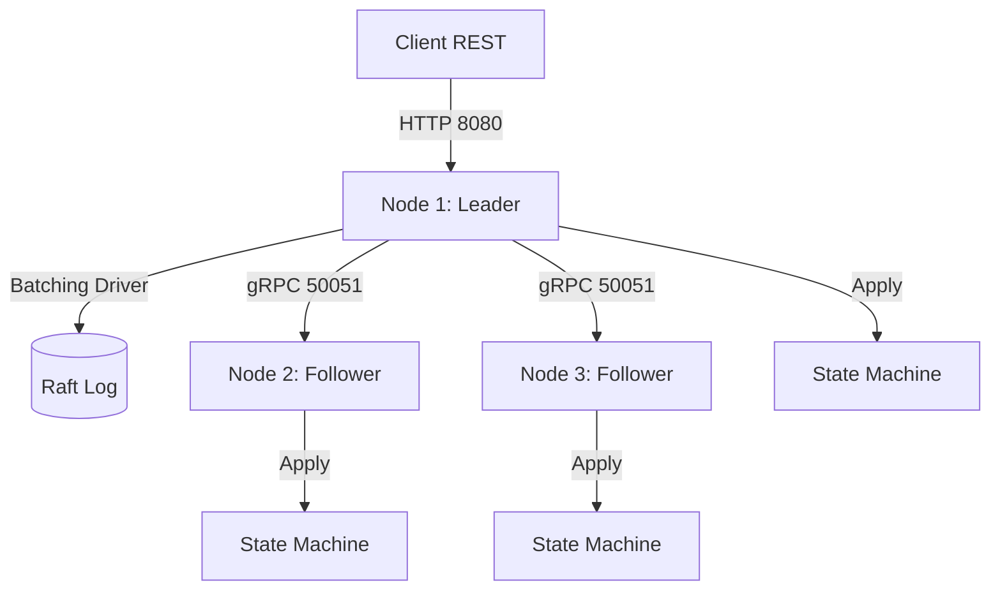

# 🔑 Kevas: High-Performance Distributed KV Store

Kevas is a distributed, Kubernetes-native key-value service built in **Rust**. It utilizes the **Raft consensus algorithm** with **aggressive request batching** to achieve extreme throughput targets (up to 1M RPS).


---

## ✨ Features

- **🚀 Extreme Throughput**: Optimized for 1,000,000 RPS using request coalescing and batching.
- **🛡️ Distributed Consensus**: Custom Raft implementation ensuring strong consistency across pods.
- **🌐 Dual API Strategy**: 
    - **REST (Axum)**: High-performance HTTP interface for clients.
    - **gRPC (Tonic)**: Low-latency binary protocol for internal replication.
- **☸️ Kubernetes Native**: Ready for deployment via StatefulSets with automatic peer discovery.
- **🧵 Thread-Safe**: Lock-sharded storage architecture (`DashMap`) for maximum concurrency.
- **🚫 Zero External Deps**: Self-contained consensus—no Redis or ZooKeeper required.

---

## 🏗️ Architecture



### Batching Mechanisms
Incoming write requests are not replicated immediately. Instead, they are collected into a **batch window** (default 5ms or 1000 items). This reduces the cost of consistency to a single roundtrip per batch, rather than per request.

---

## 🚀 Quick Start

### 1. Build
Ensure you have the Rust toolchain installed.
```bash
cargo build --release
```

### 2. Run Local Cluster (3 Nodes)
Use the included PowerShell helper to spawn a local cluster simulation:
```powershell
.\run-local.ps1
```

### 3. Deploy to Kubernetes
```bash
kubectl apply -f k8s/raft-kv.yaml
```

---

## 🔧 API Reference

### REST API (Port 8080/8081/...)
All operations are performed on the Leader node.

- **SET**: `POST /{key}`
  ```bash
  curl.exe -X POST -H "Content-Type: application/json" -d '{"value": "data"}' http://localhost:8081/mykey
  ```
- **GET**: `GET /{key}`
  ```bash
  curl.exe http://localhost:8081/mykey
  ```
- **DELETE**: `DELETE /{key}`
  ```bash
  curl.exe -X DELETE http://localhost:8081/mykey
  ```

---

## 📈 Benchmarking
We provide a Go-based benchmarking tool to stress test the cluster.

```bash
cd poc
go run bench_rest.go <threads> <duration_seconds>
# Example: Stress with 200 threads
go run bench_rest.go 200 30
```

---

## 📦 Project Structure
- `src/raft_node.rs`: Core consensus and batching logic.
- `src/api.rs`: Axum handlers for the REST layer.
- `src/grpc.rs`: Tonic implementation for Raft RPCs.
- `proto/`: Protobuf definitions for ultra-fast replication.
- `k8s/`: Kubernetes manifests for StatefulSets.

---

## 📝 License
MIT License
